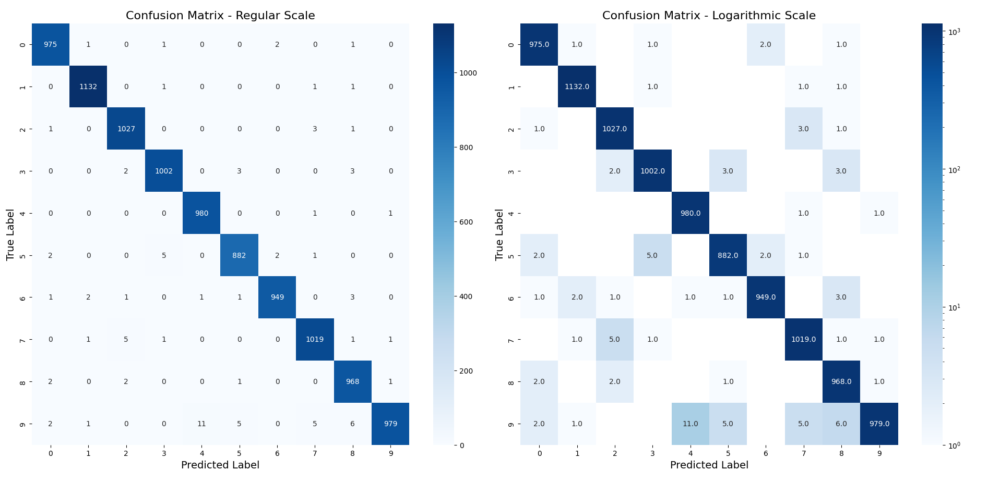
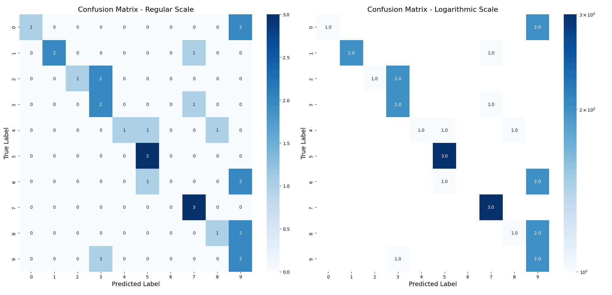
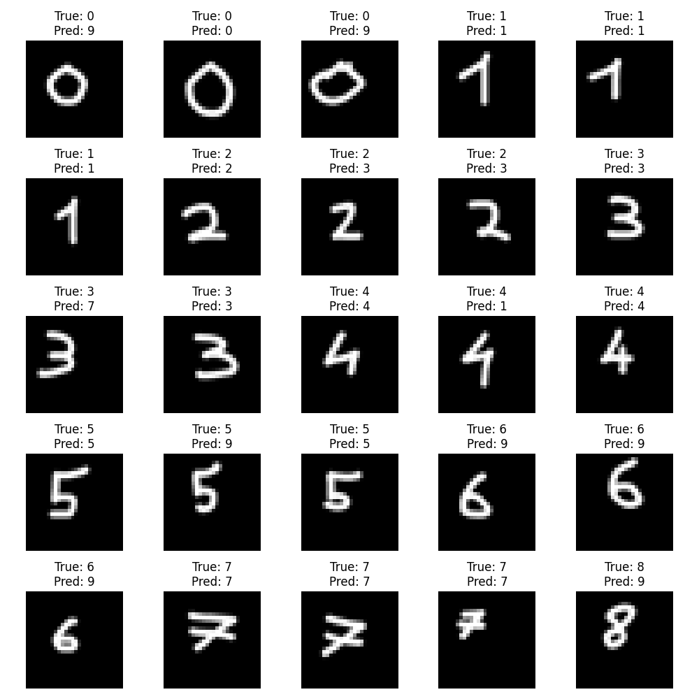
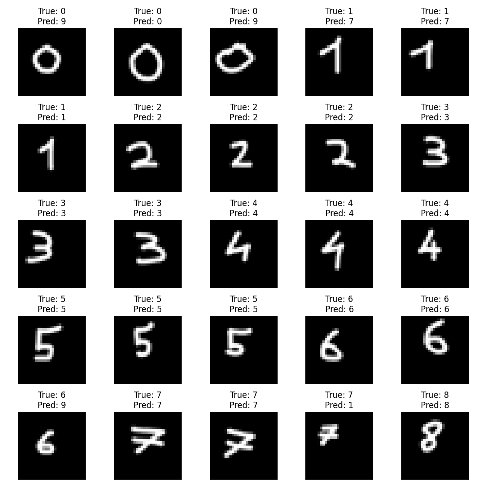

# Neural Network Basics Report

## Exercise 1
I implemented 4 different types of neural networks for the MNIST dataset: CNN, standard linear, SimpleNet, and a personal implementation.

### CNN

Test accuracy: 0.9913
Precision: 0.9912
Sensitivity (Recall): 0.9912

Other results:
- CNN variant: 0.9925
- SimpleNET: 0.9924
- Alternative SimpleNet: 0.9861
- Raw implementation in NumPy: 0.7519

The convolutional neural network performed best, as expected. CNNs are particularly well-suited for image classification tasks due to their ability to detect spatial features regardless of position.

## Exercise 2

Total images: 30
Accuracy: 0.5333
Precision: 0.6350

Total images: 30
Accuracy: 0.8000
Precision: 0.8500

The performance on my custom dataset is significantly worse than on the standard MNIST training set. This accuracy drop (from ~99% to 53-80%) occurs because:

1. **Domain shift**: My handwritten digits likely have different characteristics (stroke width, style, orientation) than those in the MNIST dataset.

1. **Preprocessing differences**: Standard MNIST images undergo consistent preprocessing, while my custom dataset may have variations in centering, scaling, and contrast.

1. **Different capture conditions**: Lighting, resolution, and background noise in my dataset differ from the controlled MNIST collection environment.

SimpleNet performs better on my dataset (80% vs 53.3%), likely due to its simpler architecture being less prone to overfitting on specific MNIST characteristics.

## Exercise 3
Random Forest performance with different parameters (num_trees, max_depth):
- 100 trees, depth 20: Test accuracy: 0.9670
- 256 trees, depth 16: Test accuracy: 0.9683
- 128 trees, depth 32: Test accuracy: 0.9687
- 64 trees, depth 8: Test accuracy: 0.9133
- 512 trees, depth 64: Test accuracy: 0.9697

The results show that increasing the number of trees generally improves accuracy, but with diminishing returns after reaching around 256 trees. Extremely shallow trees (depth 8) significantly reduce performance, while very deep trees (depth 64) offer only marginal improvement over moderate depths.
